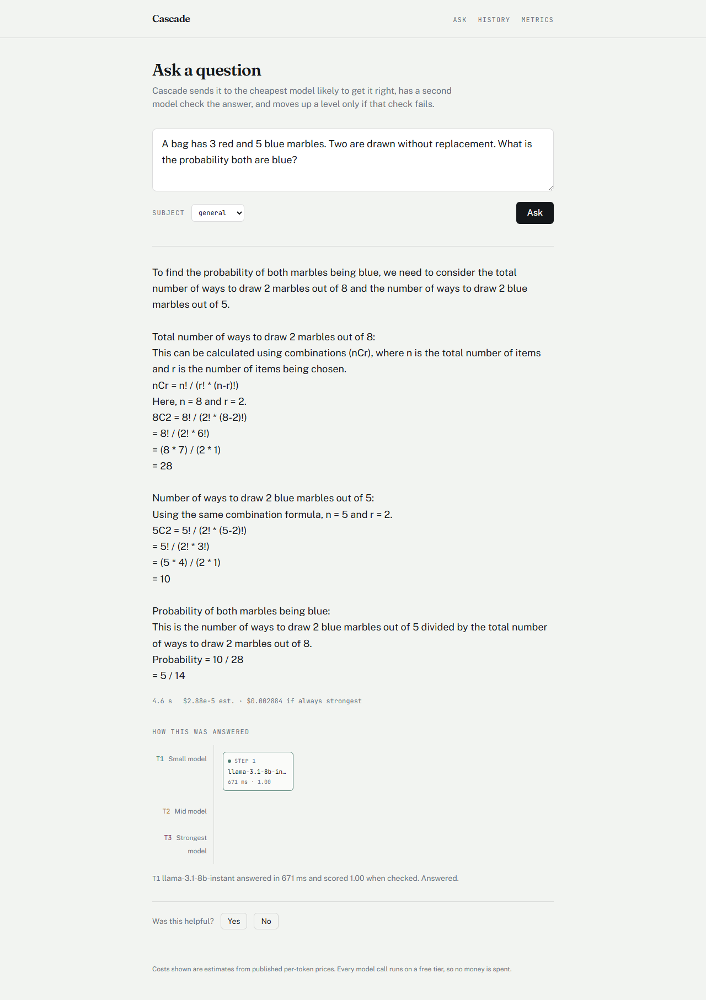
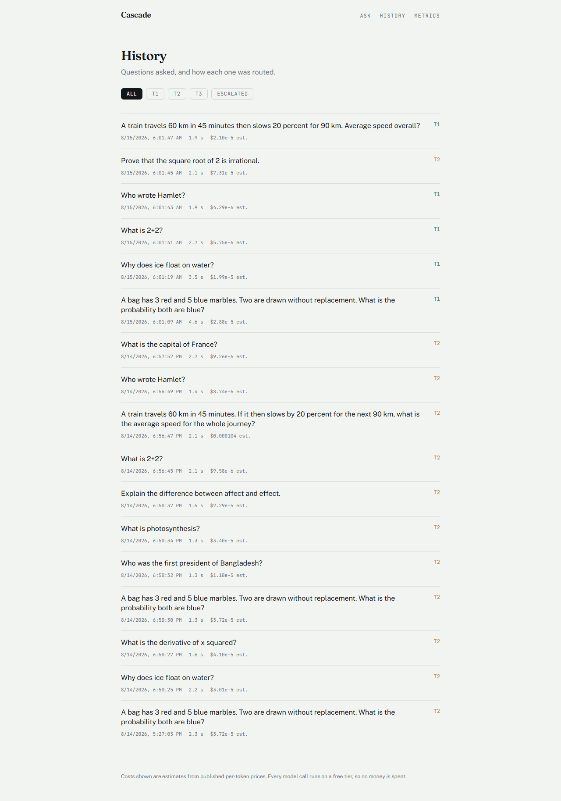
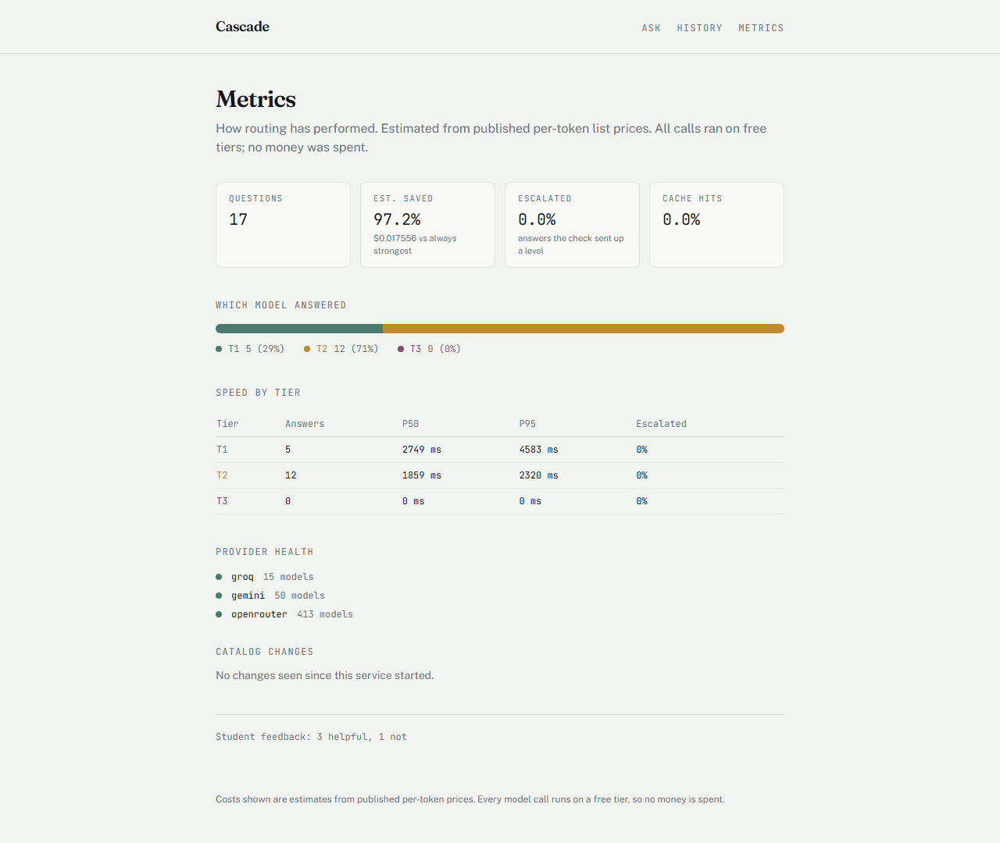

# Cascade

An AI study assistant that routes each question to the cheapest model likely to answer it correctly, has a **different provider** check the answer, and escalates only when that check fails.

Built to run entirely on free provider tiers — $0 inference, $0 hosting.

**Status:** Phases 0–4 complete. Live URL pending deploy.

---

## What it does

```
question → difficulty classifier → cheapest capable tier → answer
                                          ↓
                          verifier (heuristics, then a judge on
                          a different provider than the answerer)
                                          ↓
                          pass → return    fail → escalate one tier
```

Every answer ships with its routing trace — which model answered, how long it took, what the checker scored it, and whether it was escalated. That transparency is a product feature, not debug output.

## Key results

All figures measured, not estimated. Reproduce with `ml/eval/run_eval.py`.

### The honest headline

**The difficulty classifier did not beat the majority-class baseline.** On the held-out test split it scored **83.33% accuracy against a baseline of 84.00%** — marginally *worse* than always guessing the most common tier.

| Metric | Value |
|---|---|
| Test accuracy | 0.8333 |
| Majority-class baseline | 0.8400 |
| Improvement over baseline | **−0.0067** |
| Macro-F1 | 0.3550 |
| Test split size | 150 questions |

Per class:

| Tier | Precision | Recall | F1 | Support |
|---|---:|---:|---:|---:|
| T1 | 0.85 | 0.98 | 0.91 | 126 |
| T2 | 0.50 | 0.09 | 0.15 | 22 |
| T3 | 0.00 | 0.00 | 0.00 | 2 |

It catches 2 of 22 T2 questions and 0 of 2 T3 questions.

It is not degenerate, though — it does discriminate. Live, it routes "What is 2+2?" to T1 at 0.95 confidence and "Prove that the square root of 2 is irrational" to T2 at 0.90. Those are anecdotes; the table above is the measurement. See [`docs/final-report.md`](docs/final-report.md) for why it fails and what that means for the design.

### Ablation — the study that did work

Validation split. This is the artifact that answers whether each feature family earns its place.

| Model | Features | Dims | Accuracy | Macro-F1 |
|---|---|---:|---:|---:|
| logistic | handcrafted | 22 | 0.396 | 0.230 |
| logistic | embedding | 256 | 0.638 | 0.302 |
| logistic | both | 278 | 0.671 | 0.304 |
| boosting | handcrafted | 22 | 0.846 | 0.334 |
| boosting | embedding | 256 | 0.805 | 0.393 |
| **boosting** | **both** | **278** | **0.819** | **0.423** |

Macro-F1 rises monotonically — handcrafted 0.334, embeddings 0.393, both 0.423 — so both families carry signal and the combination is additive. Gradient boosting beats logistic regression on every feature set. No configuration beats the baseline on accuracy; boosting on handcrafted features alone ties it exactly, which is what a model that has learned to always say T1 looks like.

### Empirical labels

1,249 questions from ARC-Easy, ARC-Challenge, GSM8K, SciQ and OpenBookQA, each run through a real T1 model and, on failure, a real T2 model, then graded against known-correct answers.

| Label | Count | Share |
|---|---:|---:|
| T1 — small model was enough | 1,052 | 84.2% |
| T2 — needed a mid model | 179 | 14.3% |
| T3 — both failed | 18 | 1.4% |

**84.2% of questions were answered correctly by the cheapest model.** That is the project's central premise confirmed — and simultaneously the reason the classifier struggles, since there is very little minority class to learn from.

### Cost

| Metric | Value |
|---|---|
| Estimated cost reduction vs. always-T3 | 97.6% |
| Predicted tier sufficient | 86.0% |
| Under-predicted (verifier must escalate) | 14.0% |

**These are counterfactual.** Every call ran on a free tier; no money was spent. Costs come from published per-token list prices retrieved from OpenRouter's API on 2026-08-14. The 97.6% figure is largely a consequence of the classifier predicting T1 almost always, and must be read together with the 14% under-prediction rate that the verifier then has to absorb.

### Calibration

Expected calibration error **0.1258** on validation. The model is overconfident where it matters most: in the 0.8–1.0 band, which holds 136 of 149 validation questions, it claims 0.946 and is right 0.824 of the time. Confidence is therefore *not* used as a routing input.

### Measured provider latency

| Provider | Model | Latency |
|---|---|---|
| Groq | `llama-3.1-8b-instant` | 126 ms |
| Gemini | `gemini-flash-lite-latest` | 908 ms |
| OpenRouter | `openai/gpt-oss-20b:free` | 27.5 s |

Tier candidate ordering follows measured latency, not price.

## Screenshots

The routing trace under an answer — the element the interface is built around. An escalation is drawn as a visible step upward, not a footnote.



| History | Metrics |
|---|---|
|  |  |

Captured from `localhost`; a public URL is pending deployment.

## Architecture


```
Next.js (Vercel)
      │  HTTPS
      ▼
FastAPI gateway (Render, Docker)
      ├─ Embedder ──────────► gemini-embedding-001
      ├─ Difficulty classifier (sklearn, 569 KB .joblib)
      ├─ Router ────────────► tier selection + failover + circuit breaker
      ├─ Provider adapters ─► Groq │ Gemini │ OpenRouter
      ├─ Verifier ──────────► heuristics, then cross-provider LLM judge
      ├─ Escalation loop
      └─ Catalog poller ────► drift detection
      ▼
Supabase Postgres
```

## Setup

```bash
# Backend
cd backend
python -m venv .venv && .venv/Scripts/activate    # or source .venv/bin/activate
pip install -r requirements-dev.txt
cp ../.env.example ../.env                        # then add your API keys
uvicorn app.main:app --reload                     # http://127.0.0.1:8000/docs

# Frontend
cd frontend
npm install
npm run dev                                       # http://localhost:3000

# Reproduce the ML pipeline
cd ml
python label_empirical.py      # generates labels, caches every response
python train_classifier.py     # trains and persists the classifier
python eval/ablation.py        # ablation table
python eval/calibration.py     # calibration curve
python eval/run_eval.py        # final test evaluation — run once
```

Requires free API keys for [Groq](https://console.groq.com), [Google AI Studio](https://aistudio.google.com), and [OpenRouter](https://openrouter.ai). See `.env.example`.

## Tests

305 tests. `ruff` and `mypy --strict` clean. All HTTP is mocked with `respx`, so the suite passes offline with no API keys set.

```bash
cd backend && pytest -q
```

The provider contract suite (`tests/providers/contract.py`) is 28 shared assertions every adapter must satisfy — written before any adapter existed. It caught three real bugs, documented in `docs/adr/0002-catalog-listing-is-not-callability.md`.

## Docs

- [`docs/final-report.md`](docs/final-report.md) — full write-up, including what did not work
- [`docs/proposal.md`](docs/proposal.md) — original proposal
- [`docs/adr/`](docs/adr/) — architecture decision records
  - [0001](docs/adr/0001-provider-selection.md) — why three providers, not four
  - [0002](docs/adr/0002-catalog-listing-is-not-callability.md) — a listed model is not a callable model
  - [0003](docs/adr/0003-empirical-labels-and-pacing.md) — empirical labels, and pacing by tokens
  - [0004](docs/adr/0004-verification-before-cost-saving.md) — verification is what makes cheapness safe
- [`ops/README.md`](ops/README.md) — deployment notes
