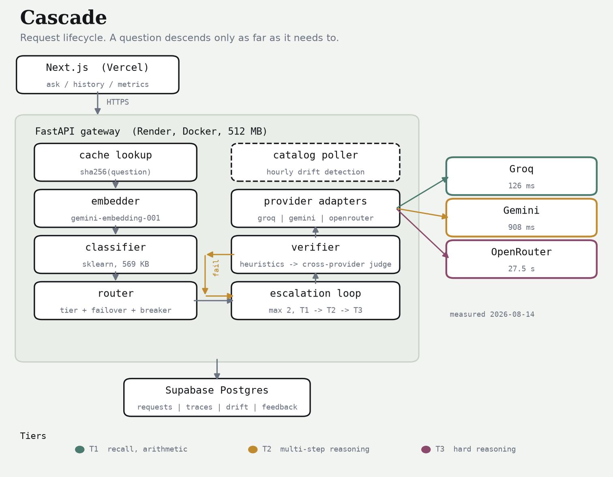

# Cascade — Final Report

**Md. Asif Hossain**
Capstone project, Ostad AI Engineering
15 August 2026

**Repository:** https://github.com/MdAsif-Hossain/Cascade
**Live site:** https://cascade-red-eight.vercel.app
**API:** https://cascade-api-5w68.onrender.com

---

## 1. What I set out to do

Cascade is a study assistant that tries to answer student questions without paying frontier prices for all of them. The idea is simple enough to state in a sentence: guess how hard a question is, send it to the cheapest model that can probably handle it, have a second model check the answer, and only move up to something more expensive if that check fails. Everything runs on free provider tiers, so the actual spend is zero and all the cost figures in this report are counterfactual.

I proposed three components as the core of the project:

1. A trained difficulty classifier
2. A quality verifier with an escalation loop
3. Catalog drift detection

Two of those work. The classifier does not, and since that was meant to be the centrepiece, most of this report is about why.



Around those three sit the parts that make it a working system: three provider adapters behind a shared contract, a router that retries and fails over, a FastAPI service with seven endpoints, a Next.js frontend, and 323 tests.

## 2. Getting the labels

The first real decision was how to label difficulty. The easy option is a proxy — assume long questions are hard, or trust the dataset a question came from. I didn't want to do that, because those labels describe what a question looks like rather than what it costs to answer, and a short question can be brutal while a long one is trivial.

So I measured it instead. I took 1,249 questions from ARC-Easy, ARC-Challenge, GSM8K, SciQ and OpenBookQA, sent each one to a real T1 model (`llama-3.1-8b-instant` on Groq), and where that failed, to a real T2 model (`gemini-3.1-flash-lite`). Both answers were graded automatically against the known-correct answer. Whichever tier got it right first became the label.

| Label | Meaning | Count | Share |
|---|---|---:|---:|
| T1 | The small model got it right | 1,052 | 84.2% |
| T2 | T1 missed, the mid model got it | 179 | 14.3% |
| T3 | Both missed | 18 | 1.4% |

The headline number here is good news for the product and bad news for the classifier. **84.2% of these questions were answered correctly by the cheapest model available.** That is the premise the whole project rests on, and it held up.

It also means the dataset is enormously lopsided. With 84% of the data in one class and 1.4% in another, a model that ignores the question entirely and always says "T1" scores 84%. That turned out to matter a lot.

I did see this coming, partly. A 60-question pilot showed T1 accuracy varying a lot by source — 100% on ARC-Easy, 92% on GSM8K, 83% on SciQ, 73% on ARC-Challenge, 71% on OpenBookQA — so before the full run I reweighted the pool towards the harder sources. It barely moved the distribution.

## 3. The classifier

### 3.1 The result

| Metric | Value |
|---|---|
| Accuracy | 0.8333 |
| Majority-class baseline | 0.8400 |
| Difference | **−0.0067** |
| Macro-F1 | 0.3550 |
| Test size | 150 |

| Tier | Precision | Recall | F1 | Support |
|---|---:|---:|---:|---:|
| T1 | 0.85 | 0.98 | 0.91 | 126 |
| T2 | 0.50 | 0.09 | 0.15 | 22 |
| T3 | 0.00 | 0.00 | 0.00 | 2 |

The confusion matrix says it plainly. Of 22 T2 questions the model found 2. Of the 2 T3 questions it found none. It sends almost everything to T1, and it is very slightly worse at that than a rule which just says "T1" every time and reads nothing.

```
              predicted
              T1   T2   T3
actual  T1   123    2    1
        T2    19    2    1
        T3     2    0    0
```

So the classifier does not work. I want to be direct about that because it was supposed to be the most technically interesting part of the project, and dressing it up would be worse than the failure itself.

One qualifier, which I offer as an observation rather than evidence. The model is not degenerate — it does respond to the question. Asking the deployed service "What is photosynthesis?" gives T1 at 0.99 confidence, and "Prove that the square root of 2 is irrational" gives T2 at 0.90. So it has learned something. It just hasn't learned enough of it, often enough, to beat a constant.

> **A note on how many times I used the test split.** The plan was to touch it once, at the end. I touched it twice. The first evaluation ran, and afterwards I found a feature that leaked (§3.3), removed it, retrained, and evaluated again. Both results are in the repository — `test_results_v1_with_leak.json` from the first run (accuracy 0.8400) and `test_results.json` from the second. Nothing was tuned between them; the only change was deleting a broken feature. The gap between the two runs is one question out of 150 and the conclusion is the same either way, but two evaluations is a weaker claim than one and I would rather say so than quietly publish the better-looking number.

### 3.2 The ablation

This is the part of the classifier work I would actually defend. The question it answers is whether the handcrafted features and the embedding are each pulling weight, or whether one of them is decoration.

| Model | Features | Dims | Accuracy | Macro-F1 |
|---|---|---:|---:|---:|
| logistic | handcrafted | 22 | 0.396 | 0.230 |
| logistic | embedding | 256 | 0.638 | 0.302 |
| logistic | both | 278 | 0.671 | 0.304 |
| boosting | handcrafted | 22 | 0.846 | 0.334 |
| boosting | embedding | 256 | 0.805 | 0.393 |
| **boosting** | **both** | **278** | **0.819** | **0.423** |

Validation split, majority-class baseline 0.846.

Three things come out of this.

Macro-F1 climbs steadily as features are added — 0.334 with handcrafted features only, 0.393 with the embedding only, 0.423 with both. Neither family is redundant, and the combination genuinely beats either half. That is the result that justifies making an embedding API call on every request, which is otherwise a hard thing to defend given it puts a network round trip on the hot path.

Gradient boosting beats logistic regression everywhere, and not narrowly. Logistic regression with balanced class weights over-corrects for the rare classes and falls to 0.396 accuracy on handcrafted features — it predicts minorities constantly and is wrong nearly every time. I reported both estimators rather than only the first because the gap is informative.

And nothing beats the baseline on accuracy. Boosting on handcrafted features alone ties it exactly at 0.846, which is exactly what you would expect from a model that has quietly settled on always answering T1.

### 3.3 A feature that shouldn't have been there

An earlier version included `num_choices` — how many answer options a question offers.

This was a mistake, and an obvious one in hindsight. `num_choices` is a fact about the benchmark, not about the question. 76% of my training rows carried four options because they came from multiple-choice datasets. A student typing into the box supplies zero, always. So the model spent training learning to read a feature whose real-world value is a constant that appeared in less than a quarter of its training data.

Two things about it are worth recording.

The measured impact was small — accuracy went from 0.8400 to 0.8333 after removing it, one question in 150. It was not the reason the classifier is weak.

And I didn't find it by testing for it. I found it while taking screenshots, when every question I asked came back routed to T2 and I went looking for a cause. The cause turned out to be something else entirely (§6), and I noticed the leak on the way past. That is not a process I'd want to rely on, so `handcrafted_features` now lives in one file shared by training and serving, and there is a test asserting that a question's feature vector doesn't change when you attach answer options to it.

### 3.4 Calibration

Expected calibration error is 0.1258 on validation.

| Confidence | n | Mean confidence | Actual accuracy | Gap |
|---|---:|---:|---:|---:|
| 0.5–0.6 | 1 | 0.561 | 1.000 | +0.439 |
| 0.6–0.7 | 4 | 0.674 | 0.500 | −0.174 |
| 0.7–0.8 | 8 | 0.754 | 0.875 | +0.121 |
| 0.8–1.0 | 136 | 0.946 | 0.824 | −0.122 |

The first three rows have 13 questions between them, so I wouldn't read much into them. The last row is the one that counts: 136 of 149 validation questions land there, and in that band the model claims 0.946 and is right 0.824 of the time. It is confidently wrong about 12% of the time on the traffic that matters.

This is why confidence isn't used as a routing signal anywhere in the system. I had considered using it — routing low-confidence questions straight to a higher tier — and this table is the reason I didn't.

### 3.5 Why I think it failed

Three reasons, in the order I think they matter.

**The class imbalance.** 84.2% / 14.3% / 1.4%. There are 18 T3 examples in the entire dataset and 2 in the test split. Nothing recovers a class from two examples, and no amount of class weighting invents data that isn't there.

**The signal might not be in the text.** This is the one I keep coming back to. Whether `llama-3.1-8b-instant` gets a question right depends on what that particular model happened to absorb during its training. It is a property of the model, not of the question. Two questions can look alike, read alike, and mean similar things while sitting on opposite sides of that model's competence boundary, and no amount of reading the question text will separate them.

**Not enough data.** 994 usable rows against 278 features is thin. More would help, though since the imbalance would persist, ten times the data still buys only ten times a very small minority.

### 3.6 What I'd do differently

Make the label binary: does the cheap model get this right, yes or no?

That is the decision the router actually makes. The T2-versus-T3 distinction only gets consulted after an escalation has already been triggered, so predicting it up front is asking for information the system doesn't use. A 1052/197 binary split is still imbalanced, but it is far more tractable than 1052/179/18, and every metric would then be measuring the choice the system genuinely faces.

I didn't restructure it after seeing the test result, because changing the target after looking at the test set is exactly the thing the held-out split exists to prevent. So this is a recommendation rather than a result.

## 4. The verifier

The verifier is why the classifier's failure doesn't sink the project.

It runs in two stages. First a set of cheap checks with no model call at all: empty output, refusals, truncation, absurd length. Anything that survives goes to an LLM judge that scores the answer between 0 and 1. Below 0.7 the question escalates a tier, capped at two escalations.

The rule I care most about is that **the judge never runs on the same provider that produced the answer.** Models prefer their own output — this is well documented — and a judge from the same family produces numbers that look like a quality measurement without being one. I enforced this structurally rather than with a check: `Verifier.verify` passes `exclude_providers={answered_by_provider}` into the router, so a same-provider judge can't be selected in the first place. Two tests assert it in both directions.

The number that ties this back to §3 is the under-prediction rate: **14.0%** of test questions were routed to a tier too weak to answer them. Those are precisely the cases the verifier catches. Running this classifier without a verifier would mean silently handing back a worse answer to about one question in seven, and nobody downstream would know.

When no cross-provider judge can be reached, the loop accepts the answer rather than escalating. That is a deliberate choice: the answer has already survived the cheap checks, and escalating everything during an outage would pile load on exactly when there's least capacity. The response carries a warning so that an unverified answer is visibly unverified rather than silently trusted.

## 5. Catalog drift

I originally wrote this component because the spec asked for it, and half-expected it to be busywork. It wasn't.

**Gemini advertises models it will not serve.** `gemini-2.5-flash`, `gemini-2.5-pro` and `gemini-2.5-flash-lite` all appear in the model-list endpoint. All three return HTTP 404 when you actually call them — *"no longer available to new users."* My first tier table was built straight from the catalog, and it was silently unroutable. A drift detector that only diffs model lists would have reported everything as fine.

**OpenRouter reports upstream failures inside a 200.** I got back `HTTP 200` with a body of `{"error": {"message": "Upstream error from Nvidia", "code": 502}}`. My adapter treated that as a malformed response, which it classified as a permanent fault, when it was actually a transient outage that should have failed over to another provider.

**Free models rate-limit independently of each other.** `google/gemma-4-31b-it:free` returned 429 in the same second that three other free models on the same account answered normally.

The conclusion, written up as ADR-0002, is that being listed and being callable are two different facts and have to be tracked separately. Every model in the tier table now has a date attached on which I confirmed it actually answers.

## 6. Engineering notes

| | |
|---|---|
| Tests | 323, passing offline with no API keys set |
| Lint / types | `ruff` and `mypy --strict` clean |
| Adapters | 3, all against one 28-assertion shared contract suite |
| Classifier artifact | 565 KB |
| Commits | 53 |
| Groq latency | 126 ms |
| Gemini latency | 908 ms |
| OpenRouter (free) latency | 27.5 s |
| Labelling run | 1,249 questions, 1 provider error |

Three things I learned the hard way.

**Rate limits are counted in tokens, not requests.** Groq allows 14,400 requests a day but only 6,000 tokens a minute. My first labelling attempt used four concurrent workers and lost 9 questions out of 60 to exhausted retries. I replaced it with a pacer that reserves token budget *before* sending, and the full 1,249-question run finished with a single error. Reacting to a 429 after it arrives is already too late — by then the budget is spent and everything in flight is about to fail too.

**Cache everything before doing anything else with it.** The labelling run got interrupted halfway through and resumed with 531 responses intact, costing nothing. The same property saved the training run when the embedding quota ran out mid-way.

**A degraded dependency is invisible unless you make it report itself.** The free embedding tier allows about 1,000 requests a day and mine ran out at 993. The classifier needs an embedding to make a prediction, so every request after that fell back to a fixed tier. That is correct behaviour and it kept the service answering questions. But from outside it looked exactly like a working classifier that had decided every question was T2, and I spent close to an hour chasing the wrong cause. The only thing that eventually gave it away was the `prediction_source: "no_embedding"` field in the API response. I'd added that field early on without much thought about why; it turned out to be the most useful line of code in the project.

## 7. Deployment

The system runs on three free services: the frontend on Vercel, the API on Render as a Docker container, and Postgres on Supabase. Total cost is zero, which was a hard constraint from the start rather than a nice-to-have.

Getting there produced four problems worth recording, because none of them were about the code being wrong.

**CI failed on a commit that was fine.** The workflow triggered on `push` with no ref filter, so pushing the `v0.1-proposal` tag re-ran the whole pipeline against a commit from before a fix, and reported a failure that said nothing about the current tree. Tags label history; they are not something to re-test.

**SQLAlchemy ships no database driver.** Everything worked locally on SQLite, which is built into Python. Pointing `DATABASE_URL` at Supabase would have raised `ModuleNotFoundError: No module named 'psycopg2'` on the first connection. I caught this reading the requirements file while writing the deployment guide, not from a failure — the local test suite would never have found it, because it never touches Postgres.

**Supabase's direct connection host is IPv6-only** and Render's free tier has no IPv6. The failure mode is a connection timeout with nothing pointing at the cause. The session pooler hostname is IPv4 and works.

**`NEXT_PUBLIC_*` variables are compiled in at build time.** Setting `NEXT_PUBLIC_API_BASE` on Vercel changes nothing until a new build runs, and marking it "Sensitive" stops it being inlined at all — which is coherent, since sensitive means "never expose" and `NEXT_PUBLIC_` means "expose this". The two settings contradict each other and the variable is silently dropped. The site kept serving a bundle with `127.0.0.1:8000` compiled into it, and the browser blocked the request as mixed content before it ever left the page, so nothing appeared in the network log to debug from.

The common thread is that all four were configuration, invisible to the test suite, and produced errors that named something other than the actual problem. That is most of what deployment turned out to be.

## 8. Limitations

1. **The classifier doesn't beat a majority-class baseline.** It scores 0.8333 against 0.8400 and finds almost no T2 or T3 questions. In practice its routing decisions amount to "always T1".
2. **The 97.6% cost reduction figure follows from that failure rather than from good routing.** Because nearly everything is predicted T1, the routed cost is nearly always T1 cost. The arithmetic is right and no money was spent either way, but the number should be read as "what always-T1 routing costs", next to the 14% under-prediction rate the verifier has to absorb.
3. **T3 is statistically meaningless.** 18 examples in total, 2 in the test split. Its precision, recall and F1 are noise and nothing should be concluded from them.
4. **Only 994 of 1,249 labelled questions were used.** The free embedding quota ran out at 993 vectors. Every feature set uses the identical subset so the ablation is still a fair comparison, but there is less statistical power here than the label count suggests.
5. **The test split was evaluated twice** (§3.1), not once as planned.
6. **The question pool isn't representative of real student questions.** It's public benchmark data, deliberately weighted towards the harder sources. Real questions would skew easier, so if anything the cost figures are conservative.
7. **The verifier's threshold of 0.7 and cap of 2 escalations are untuned.** They came from the specification. Tuning them properly would need a labelled set of good and bad *answers*, which I don't have — my labels record whether a model was correct, not whether the judge agreed.
8. **The judge is a cheap model and is sometimes wrong.** Its scores are a filter, not ground truth.
9. **Quality retention against an always-T3 baseline wasn't measured directly.** What I report is how often the predicted tier was strong enough (86.0%), which is a proxy. It doesn't measure whether the answer that came back was actually good.
10. **Both services sleep.** The system is deployed and working end to end — frontend on Vercel, API on Render, database on Supabase — and the screenshots in `docs/screenshots/` are from the live site. But Render's free tier spins the container down after 15 minutes of inactivity, so the first request after a quiet period takes around 50 seconds while it wakes. A cron ping every 10 minutes keeps it warm. Supabase also pauses free projects after 7 days of no traffic, which would need a manual unpause.

## 9. Conclusion

The cost argument survived. The learnability argument didn't.

84.2% of the questions I tested were answered correctly by the cheapest model I had access to. That is the finding the entire product depends on and it is solid. What did not survive is my assumption that a classifier could pick out the remaining 15.8% by reading the question. At this scale, with these features, it can't, and the honest measurement is a dead heat with guessing.

What makes that survivable is the verifier, and I didn't expect to be writing that sentence. The 14% of questions routed too cheaply get caught by a second model from a different provider and escalated. Cost reduction without that check would just be quality reduction with better marketing. With it, the same routing behaviour is safe to ship. The component I had mentally filed as plumbing around the interesting part turned out to be the part holding the system up.

If I picked this up again I wouldn't start by reaching for a better model. I'd start by asking a smaller question. "Which of three tiers does this need" demands more than the router ever uses. "Will the cheap model get this right" is one binary decision, with five times the minority data behind it, and it's the decision the system is actually making every time somebody types a question into the box.

The system is live at https://cascade-red-eight.vercel.app. Ask it something and the trace under the answer will tell you which model replied, how long it took, and what the checker made of it — including, if the first attempt wasn't good enough, the step up to a stronger one.
